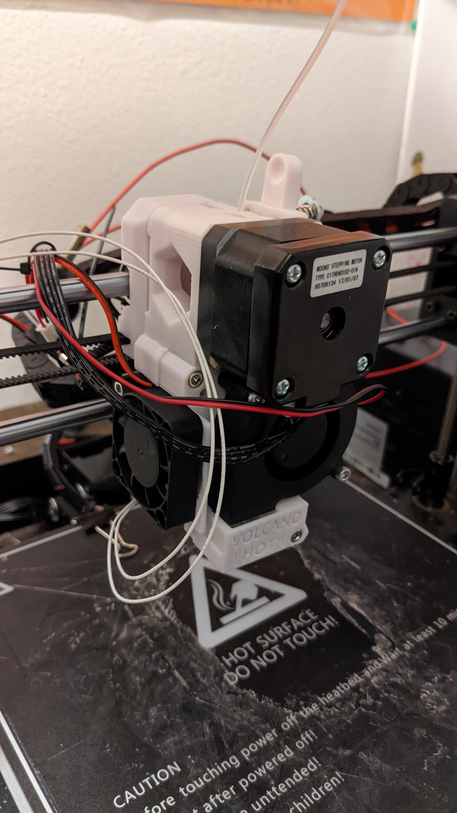

# Frankie MakerSelect V2 Upgrade
## Introduction

This project is about updating my MakerSelect V2 by Monoprice. I am calling this project Frankie because it will turn this printer into a Frankenstein style mixure of parts I like from various projects. My original insperation was the Dolly MK2 clone that Thomas Sanladerer did. Someone made a repo containing the changes and details of that project [here](https://github.com/avolkov/Dolly-i3-M8-Rod-Z-Axis)

## Goals
 * Replace the Melzi board with Ramps 1.4 ATMEGA
 * Replace the stock x carrage and extruder with one similar to Prusa MK2S
 * Improve Z access stability of frame

## Current State
 * Stock MSV2 x carrage replaced with modified Prusa part. Part was modified in the SCAD file as well as STL.
 * Extruder body, cover, and cooler are modified for a Volcano clone. These parts will eventually be replaced, for now they can be found on Thingaverse
   * [ExtruderBody](https://www.thingiverse.com/thing:2117460)
   * [PartFan](https://www.thingiverse.com/thing:3910078)

## Volcano Hotend
This upgrade is still being tested but early results are showing substantial improvements from the original hot end of the MSV2. The improvemtnes are primarily in bridging. The benchy tugboat has much better overhangs and horizontal top serfaces bridge support structure much better. Also the switch to an all metal hotend allows for printing at much higher temperatures and at much higher speeds.

First draft, it still needs some wire managment added and probably re-printed in a higher temp plastic.

## Prusa i3 MK2S-Dolly (Repo this project is based on)

## Introduction

This is a fork of the Original Prusa i3 MK2S found [here](https://github.com/prusa3d/Original-Prusa-i3/tree/MK2S). It reworks the design slightly to make it compatible with more commonly available parts. It builds on changes that were made by [Thomas Sanladerer](https://www.youtube.com/channel/UCb8Rde3uRL1ohROUVg46h1A) for his great video series on building a Prusa i3 MK2 clone, named, [Dolly](https://en.wikipedia.org/wiki/Dolly_%28sheep%29). You can find the BOM and other details of Tom's project on his [site](toms3d.org/dolly/).

[[Playlist]](https://www.youtube.com/playlist?list=PLDJMid0lOOYkdh8jCqIw7AFIHQiuKbSKZ)

Tom's project was based on the Original Prusa i3 MK2. The MK2S was released during filming but after he had already printed the parts. Here we use the MK2S as the base and iterate on that by back-porting Tom's changes from his STL files to the OpenSCAD source material to allow future editing and adding a few further changes for things that he discovered during the assembly process as well as some additional ideas for improvements.

Big thanks to Thomas Sanladerer for a great video series and for creating the original compatible parts! Support him on [Patreon](https://www.patreon.com/toms3dp), watching his videos or using the affiliate links in his BOM.

